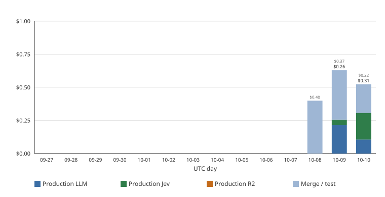

# Production call costs

Paid calls from each successful daily pipeline run. One row per service and model is appended to `costs/ledger.csv` on the `data-snapshot` branch. This page and `daily_spend_14d.svg` are regenerated from that ledger. They are not in `public/` and are not deployed to GitHub Pages.

DeepInfra labeling dollars are the provider's `usage.estimated_cost` on each response. Jev dollars are computed, not reported by the API: input tokens × $0.042 per 1,000,000 (published price dated 2026-10-08). Jev output tokens are free. R2 Standard list prices, dated 2026-10-08: $0.015 per GB-month of storage (one day is that price ÷ 30), $4.50 per million Class A operations, $0.36 per million Class B operations, egress free. R2 is currently inside the monthly free tier (10 GB-month storage, 1,000,000 Class A operations, and 10,000,000 Class B operations), so the R2 column and the chart show $0.00. Local embeddings, GitHub Actions, and Bluesky reads are not listed.

Posts are the `total_posts` figure in that run's `data.json` (claims that entered clustering). Planets are every planet written into that file, including section solar systems. Both are counted once per run, even when the run has a DeepInfra row, a Jev row, and an R2 row. `$ per 1,000 posts` is total dollars ÷ posts × 1,000. `$ per planet` is total dollars ÷ planets published. The table uses billed `cost_usd`. For R2 that is spend above the monthly free tier. `list_price_usd` is the list price of that row. A same-day rerun that shrinks storage records $0 rather than a credit.

## Last 14 days

One bar per UTC day. The main label is production billed spend for that day (target about 0.25, fallback 0.30). A smaller gray label is merge- or test-triggered spend on the same day. The weekly table below still totals every row. The chart is rewritten on this branch each run.

## By ISO week

| ISO week | runs | LLM $ | Jev $ | R2 $ | total $ | posts processed | planets published | $ per 1,000 posts | $ per planet |
| --- | ---: | ---: | ---: | ---: | ---: | ---: | ---: | ---: | ---: |
| 2026-W41 | 11 | 1.09513636 | 0.24124392 | 0.00 | 1.33638028 | 109034 | 1149 | 0.01225655 | 0.00116308 |

## Last 30 days

Runs whose `date_utc` is on or after 2026-09-10 (through 2026-10-10).

| runs | LLM $ | Jev $ | R2 $ | total $ | posts processed | planets published | $ per 1,000 posts | $ per planet |
| ---: | ---: | ---: | ---: | ---: | ---: | ---: | ---: | ---: |
| 11 | 1.09513636 | 0.24124392 | 0.00 | 1.33638028 | 109034 | 1149 | 0.01225655 | 0.00116308 |
